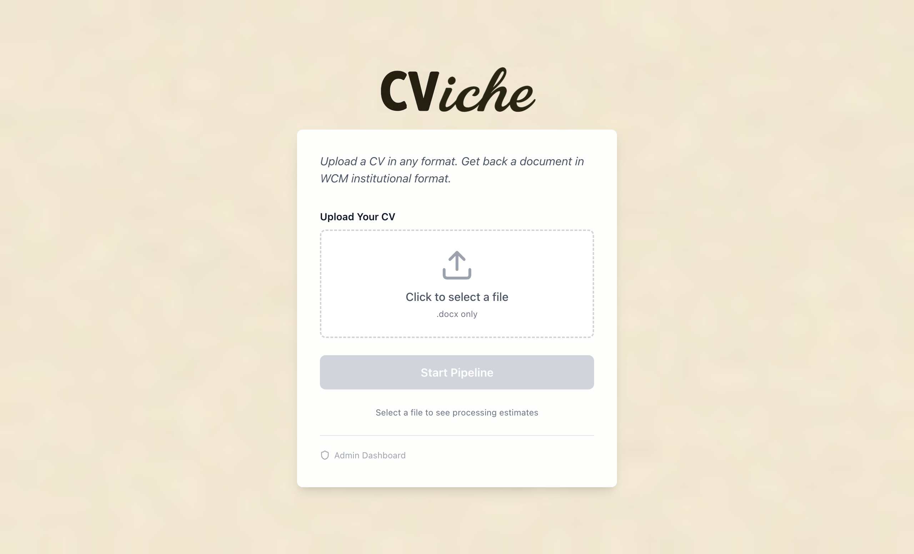
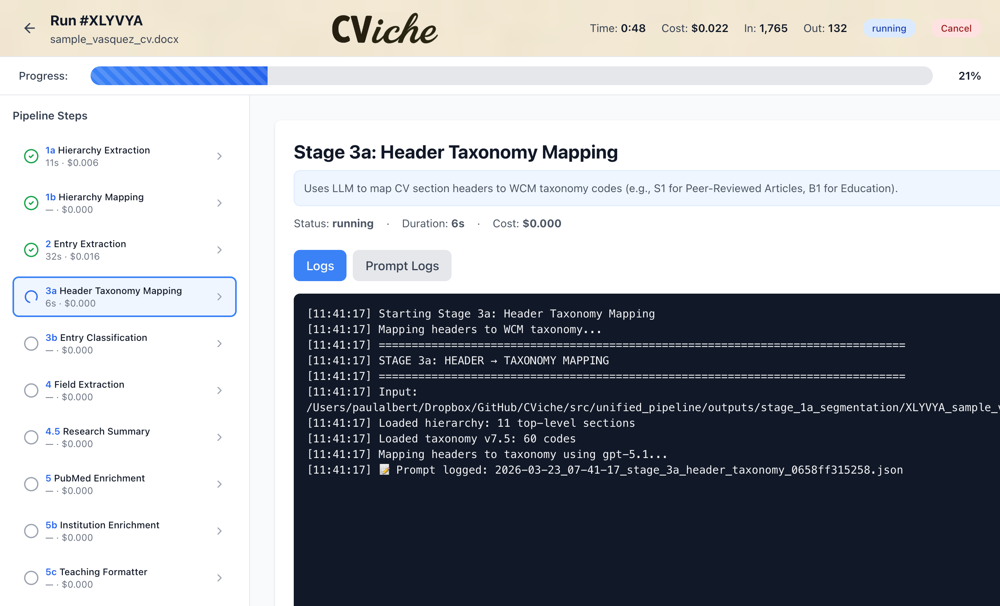
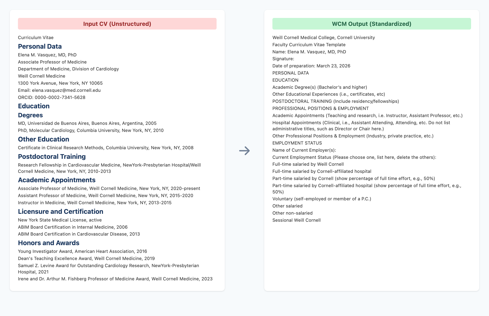
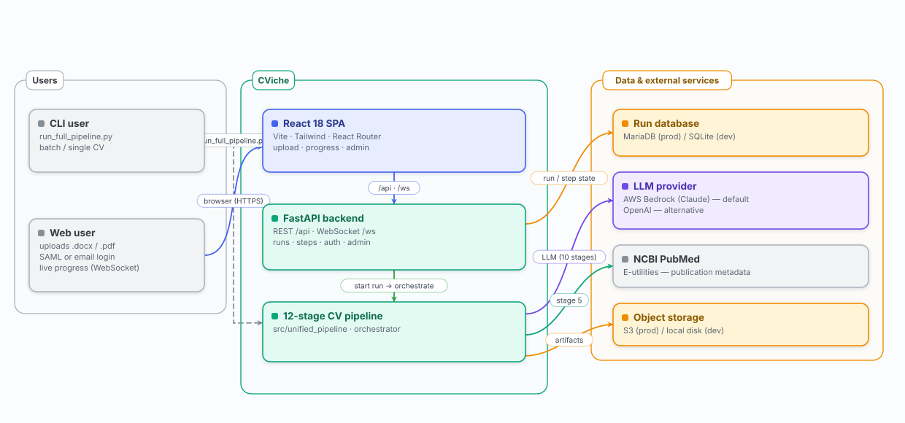
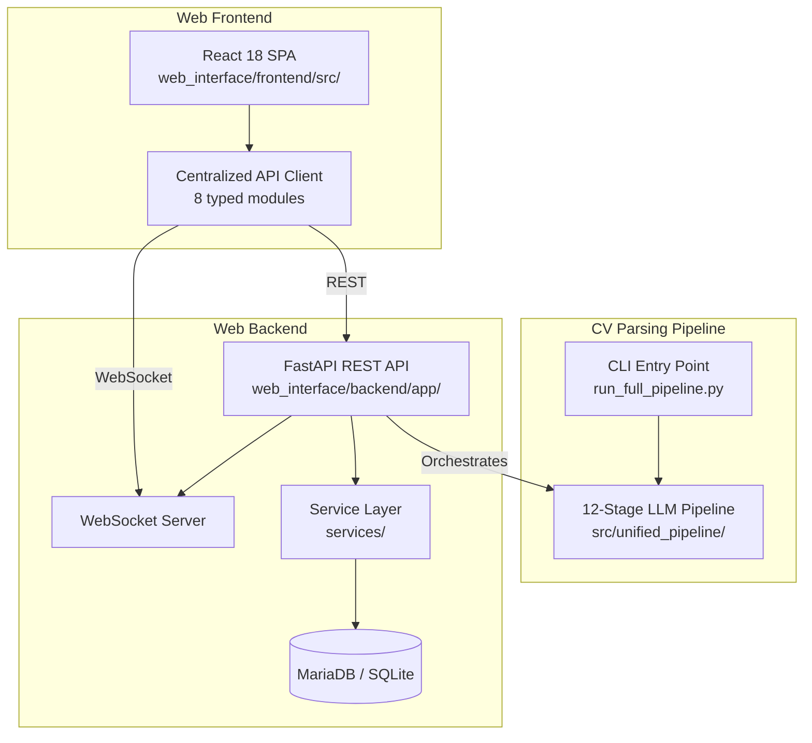

# CViche

AI-powered CV parsing pipeline that transforms unstructured academic CVs into standardized WCM format.

## What It Does

CViche takes unstructured academic CVs in Word (.docx) format and runs them through a 12-stage AI pipeline. The output is a standardized Word document formatted to the Weill Cornell Medicine (WCM) curriculum vitae template. Stages range from document segmentation and entry extraction to PubMed enrichment and citation formatting -- all orchestrated through a single CLI command or web interface.

Word documents are required because `.docx` heading styles and paragraph structure provide critical signals for segmentation and entry boundary detection that plain text or PDF extraction cannot reliably reproduce.

```bash
python3 run_full_pipeline.py sample_vasquez_cv
```

## Visual Overview







## Pipeline Stages

1. **Stage 1a -- Segmentation**: LLM-powered hierarchical segmentation of CV document structure
2. **Stage 1b -- Hierarchy Mapping**: Maps extracted headers to document element indices (no LLM)
3. **Stage 2 -- Entry Extraction**: Detects individual entries and extracts text using LLM
4. **Stage 3a -- Header Taxonomy Mapping**: Maps CV section headers to WCM taxonomy codes
5. **Stage 3b -- Entry Classification**: Classifies entries using header context and content analysis
6. **Stage 4 -- Field Extraction**: Extracts structured fields from classified entries using domain-specific parsers
7. **Stage 4.5 -- Research Summary**: Generates a biosketch-style research summary (NIH M1 format)
8. **Stage 5 -- PubMed Enrichment**: Enriches publications with PubMed metadata via NCBI E-utilities
9. **Stage 5b -- Institution Enrichment**: Adds city/state/country to institutional affiliations via LLM (batched, with a local cache)
10. **Stage 5c -- Teaching Formatter**: Reformats teaching entries for consistent presentation
11. **Stage 5d -- Citation Formatter**: Reformats non-enriched citations to Vancouver style
12. **Stage 6 -- Word Output**: Generates the final formatted Word document using the WCM template

## Getting Started

### Prerequisites

- Python 3.11+
- LLM provider credentials -- either:
  - **AWS Bedrock** (default): uses the boto3 default credential chain (env vars, `~/.aws/credentials`, or IAM roles)
  - **OpenAI**: get a key at [platform.openai.com/api-keys](https://platform.openai.com/api-keys)
- Node.js 18+ (for the web frontend)

### Installation

```bash
git clone https://github.com/wcmc-its/CViche.git
cd CViche
pip install -r requirements.txt
```

### Configuration

Set your LLM provider API key:

```bash
# AWS Bedrock (default -- uses the boto3 credential chain)
export AWS_ACCESS_KEY_ID=your-key
export AWS_SECRET_ACCESS_KEY=your-secret
export AWS_DEFAULT_REGION=us-east-1

# OR OpenAI -- also set provider: openai in src/unified_pipeline/config/llm_config.yaml
export OPENAI_API_KEY=your-key-here
```

Pipeline behavior is tuned via two files: `config.yaml` (taxonomy, PDF processing, and extraction parameters) and `src/unified_pipeline/config/llm_config.yaml` (LLM provider and per-stage model selection). The latter defaults to AWS Bedrock with Claude Sonnet 4.6; set `provider: openai` there to use OpenAI instead. See [Environment Variables](#environment-variables) for the full list of configuration options.

## Architecture

Four version-controlled architecture views document CViche. They are generated from plain-data specs by a dependency-free renderer (`scripts/diagrams/`) and fact-checked against the source on every build, so they cannot silently drift from the code. Browse them together in the **[architecture gallery](docs/architecture/index.html)** (open locally, or ⌘/Ctrl+P → Save as PDF for slides).

| View | What it answers |
|------|-----------------|
| [① System context](docs/architecture/context.svg) | What feeds CViche and who it serves |
| [② 12-stage pipeline](docs/architecture/pipeline.svg) | Each stage, the model/API it uses, and the data flow |
| [③ Web app & run lifecycle](docs/architecture/runtime.svg) | How a browser drives a run: upload → live progress → download |
| [④ Deployment topology](docs/architecture/deployment.svg) | EKS, the ALB ingress, the HPA, and IRSA → Bedrock |

[](docs/architecture/index.html)

Regenerate after the system changes with `node scripts/diagrams/build.mjs` (writes SVG + PNG + the gallery `index.html`); see [`scripts/diagrams/README.md`](scripts/diagrams/README.md). The quick layered overview below is kept for at-a-glance orientation.



CViche has three layers:

- **CV Parsing Pipeline** (`src/unified_pipeline/`): A 12-stage LLM pipeline where each stage produces JSON consumed by the next stage. All LLM calls go through a unified `call_llm()` abstraction that supports OpenAI and AWS Bedrock, with per-stage model configuration via `src/unified_pipeline/config/llm_config.yaml` (default: AWS Bedrock / Claude Sonnet 4.6). Entry points are the CLI (`run_full_pipeline.py`) and the web backend's pipeline orchestrator.

- **Web Backend** (`web_interface/backend/app/`): A FastAPI REST API with WebSocket support for real-time pipeline progress. Uses SQLAlchemy ORM with MariaDB (production) or SQLite (development). Follows a service layer pattern with dedicated modules for access control, configuration, user provisioning, and admin queries.

- **Web Frontend** (`web_interface/frontend/src/`): A React 18 single-page application built with Vite and Tailwind CSS. Communicates with the backend through a centralized API client with typed functions. Displays real-time pipeline progress via WebSocket.

The system supports two execution modes: **CLI** for batch processing and **web** for interactive use with real-time progress tracking. File storage is abstracted behind a backend that supports both local filesystem (development) and S3 (production).

For pipeline internals, data schemas, and API details, see [Technical Documentation](docs/TECHNICAL_README.md).

## Contributing

`dev` is the integration branch — branch from `origin/dev`, PR into `dev`, and
close the issue manually once it lands (a merge to `dev` does not auto-close,
because GitHub only auto-closes from the default branch). See
**[Dev workflow](docs/DEV_WORKFLOW.md)** for the full working agreement: branching,
merging a batch of PRs safely, running corpus batches, PII rules, the measurement
landmines, and how to brief a parallel working session.

## Web Interface

### Docker (Recommended)

```bash
cd web_interface
docker compose up --build
```

| Service  | Port | Description            |
|----------|------|------------------------|
| MariaDB  | 3306 | Database               |
| Backend  | 8000 | FastAPI API server     |
| Frontend | 3000 | React web application  |

Set the `OPENAI_API_KEY` environment variable before running `docker compose` (or configure AWS credentials for Bedrock -- see [Configuration](#configuration)).

### Production Deployment

Production runs the backend image with `CVICHE_RUN_MIGRATIONS=0` so that N replicas don't race `alembic upgrade head` against the shared database. Run migrations as a one-shot step before bringing the service up.

**docker compose (single-host prod):**

```bash
# 1. Run migrations once. Exits 0 on success, non-zero on failure.
docker compose -f docker-compose.yml -f docker-compose.prod.yml \
    run --rm backend migrate

# 2. Bring up the service (backend skips migrations because CVICHE_RUN_MIGRATIONS=0).
docker compose -f docker-compose.yml -f docker-compose.prod.yml up -d
```

**k8s:** run the same image with the command `["migrate"]` as a `Job` (or an `initContainer` that shares the main container's image). Set `CVICHE_RUN_MIGRATIONS=0` on the main `Deployment` so the application pods skip migrations entirely.

**ECS:** run a one-shot `RunTask` with the backend image and `command: ["migrate"]` as a pre-deploy step in your pipeline; the service task definition sets `CVICHE_RUN_MIGRATIONS=0`.

The entrypoint accepts the literal argument `migrate` (run migrations and exit) or any other argument (passed to `uvicorn`). With no argument it starts uvicorn directly.

### Production: provisioning `auth_config.yaml`

`web_interface/backend/auth_config.yaml` is environment-specific (it carries the allowed-users list, SAML SP / IdP settings, and ED-group authorization config) and is gitignored. It is therefore **not baked into the image**. `app/config_loader.py` falls back to `auth_config.yaml.example` if the file is missing -- the app boots in a locked-down state instead of crashing -- but real production must mount a real config.

**docker compose (single-host prod)** -- point `CVICHE_AUTH_CONFIG_HOST_PATH` at the host path of the provisioned file, then bring up the service:

```bash
export CVICHE_AUTH_CONFIG_HOST_PATH=/etc/cviche/auth_config.yaml
docker compose -f docker-compose.yml -f docker-compose.prod.yml up -d
```

`docker-compose.prod.yml` mounts that file read-only at the canonical in-container path `/app/web_interface/backend/auth_config.yaml`. If `CVICHE_AUTH_CONFIG_HOST_PATH` is unset, compose falls back to mounting `./backend/auth_config.yaml` from the repo (the dev convention).

**Kubernetes** -- provision `auth_config.yaml` as a `Secret` (preferred, since it may contain SAML private keys or ED group DNs) or `ConfigMap`, and mount it at the same canonical in-container path. Drop the compose `volumes:` mount entirely and use a pod-level `volumeMounts` instead:

```yaml
volumeMounts:
  - name: auth-config
    mountPath: /app/web_interface/backend/auth_config.yaml
    subPath: auth_config.yaml
    readOnly: true
volumes:
  - name: auth-config
    secret:
      secretName: cviche-auth-config
```

**ECS** -- store `auth_config.yaml` in AWS Secrets Manager (or as an SSM parameter), then either fetch it into the host at task start and bind-mount, or render it into the task definition's `secrets` block and mount via a Docker volume.

Verify after deploy: `docker compose exec backend cat /app/web_interface/backend/auth_config.yaml` must show your real config, not the `.example` defaults. Watch the application logs for `auth_config.yaml not found ... falling back to auth_config.yaml.example` -- that line means the mount failed.

### Local Development (without Docker)

**Backend:**

```bash
cd web_interface/backend
pip install -r requirements.txt
uvicorn app.main:app --port 8000 --reload
```

**Frontend:**

```bash
cd web_interface/frontend
npm install
npm run dev    # Starts on port 3001, proxies API to :8000
```

| Mode      | Backend Port | Frontend Port | Database              |
|-----------|-------------|---------------|-----------------------|
| Docker    | 8000        | 3000          | MariaDB (container)   |
| Local dev | 8000        | 3001          | SQLite (file)         |

## Service Layer

The backend follows a service layer pattern: thin route handlers delegate business logic to dedicated service modules in `web_interface/backend/app/services/`.

| Module | Purpose |
|--------|---------|
| `config_service.py` | Centralized application constants with `CVICHE_*` environment variable overrides |
| `run_service.py` | Run access control (owner-or-admin authorization) |
| `user_service.py` | User provisioning for both auth modes (email and SAML) |
| `admin_service.py` | Aggregation queries for the admin dashboard (O(1) complexity via database queries) |

Related centralized backend modules:

| Module | Purpose |
|--------|---------|
| `errors.py` | Structured error response factories (no stack traces in production) |
| `rate_limiter.py` | Per-user daily and monthly run limits, per-IP login attempt limiting |
| `auth.py` | Session management and authentication middleware |

## Authentication

CViche supports two authentication modes, config-gated via `auth_config.yaml`:

- **Simple mode (default):** Email-based login with an allowed-users list defined in `auth_config.yaml`. Suitable for development and small deployments.

- **SAML mode:** pysaml2-based SAML 2.0 Service Provider with auto-generated self-signed certificates. Supports federated login via an institutional Identity Provider and ED group-based authorization for role assignment.

The active auth mode is set in `auth_config.yaml` via the `auth.mode` field. SAML mode is fully implemented and config-gated; simple mode remains the default until WCM IdP registration is approved.

Session management uses signed cookies via itsdangerous with a configurable secure flag. The same session cookie authenticates both REST API requests and WebSocket connections. Sessions include per-request database checks for user status and role synchronization.

## Security

CViche implements defense-in-depth security practices:

- **Security headers:** Content Security Policy, X-Frame-Options, X-Content-Type-Options, HSTS, and Referrer-Policy applied to all responses
- **CORS:** Restricted to configured origins via `CVICHE_ALLOWED_ORIGINS`
- **CSRF protection:** Origin header validation middleware on state-changing requests
- **Rate limiting:** Per-user daily and monthly run caps; per-IP login attempt limiting
- **Error sanitization:** Structured error responses with no stack traces or internal paths exposed to clients
- **Upload validation:** File type verification via magic bytes and configurable size limits
- **Session security:** Signed cookies with configurable secure flag and expiration

## Frontend Architecture

The frontend uses a centralized API client pattern. Eight modules in `web_interface/frontend/src/api/` provide typed functions for all backend communication:

| Module | Scope |
|--------|-------|
| `admin.ts` | Admin dashboard queries |
| `auth.ts` | Login, logout, session check |
| `client.ts` | Base HTTP client with error handling |
| `consent.ts` | Consent form management |
| `feedback.ts` | Feedback submission |
| `runs.ts` | Pipeline run CRUD and history |
| `upload.ts` | File upload with progress |
| `websocket.ts` | Real-time pipeline progress |

Key patterns:

- **Shared type definitions** in `src/types/` ensure type safety across components
- **Environment-derived API URLs** -- no hardcoded endpoints; the base URL is read from `VITE_API_URL` (defaults to empty for Vite proxy in development)
- **AuthContext** provides session state management across the application
- **React Router** handles client-side navigation

## Environment Variables

All backend configuration uses `CVICHE_*` prefixed environment variables with sensible defaults for local development. Either `OPENAI_API_KEY` (for OpenAI) or AWS credentials (for Bedrock) are required to get started.

### LLM Provider

| Variable | Description | Required |
|----------|-------------|----------|
| `OPENAI_API_KEY` | OpenAI API key for LLM pipeline stages | Yes (if using OpenAI) |
| `AWS_ACCESS_KEY_ID` | AWS access key for Bedrock | Yes (if using Bedrock without IAM roles) |
| `AWS_SECRET_ACCESS_KEY` | AWS secret key for Bedrock | Yes (if using Bedrock without IAM roles) |
| `AWS_DEFAULT_REGION` | AWS region for Bedrock (default: `us-east-1`) | No |
| `NCBI_API_KEY` | NCBI API key for faster PubMed queries | No |

The pipeline runs on Claude (Anthropic) models via Bedrock by default. To use OpenAI instead, set `provider: openai` in `src/unified_pipeline/config/llm_config.yaml`.

### Database and Storage

| Variable | Description | Default |
|----------|-------------|---------|
| `DB_HOST` / `DB_PORT` / `DB_NAME` / `DB_USER` | Database connection parameters, resolved individually (env first, then `auth_config.yaml`'s `db:` section). There is no `DATABASE_URL` code path. | none — all four are required, the engine factory hard-raises without them |
| `MIGRATE_USER` | DB user Alembic connects as. Separate from `DB_USER`. | none |
| `DB_PASSWORD` | When set, the engine uses password auth instead of RDS IAM tokens and skips TLS. Local dev only; deployed environments leave it unset. | unset (IAM auth) |
| `CVICHE_STORAGE_BACKEND` | Storage backend: `local` or `s3` | `local` |
| `CVICHE_S3_BUCKET` | S3 bucket name (required when storage backend is `s3`) | -- |
| `CVICHE_S3_PREFIX` | S3 key prefix | `cviche` |

### Authentication and Sessions

| Variable | Description | Default |
|----------|-------------|---------|
| `CVICHE_SESSION_SECRET` | Cookie signing key (random fallback if unset -- sessions lost on restart) | Random |
| `CVICHE_SECURE_COOKIES` | Enable secure cookie flag | `true` |

### Security (values not shown)

These variables control security-sensitive thresholds. They have sensible defaults; see the source code for details.

| Variable | Description |
|----------|-------------|
| `CVICHE_SESSION_TTL` | Session expiration duration |
| `CVICHE_LOGIN_RATE_LIMIT` | Login attempt limit per window |
| `CVICHE_LOGIN_RATE_WINDOW` | Login rate limit window duration |
| `CVICHE_MAX_UPLOAD_MB` | Maximum upload file size |
| `CVICHE_ALLOWED_ORIGINS` | Comma-separated CORS allowed origins |

### Frontend

| Variable | Description | Default |
|----------|-------------|---------|
| `VITE_API_URL` | Backend API base URL (frontend) | Empty (uses Vite proxy) |

## Running the Pipeline (CLI)

```bash
# Run full pipeline on a CV
python3 run_full_pipeline.py path/to/cv.docx

# Run full pipeline using document UID
python3 run_full_pipeline.py sample_vasquez_cv

# Run a single stage
python3 run_full_pipeline.py sample_vasquez_cv --stage 3b

# Specify LLM model (OpenAI)
python3 run_full_pipeline.py sample_vasquez_cv --model gpt-4.1

# Use AWS Bedrock (set provider in config.yaml to "bedrock")
python3 run_full_pipeline.py sample_vasquez_cv
```

Stage outputs are written to `src/unified_pipeline/outputs/stage_*/`, with each stage producing a JSON file named by the document UID.

## Sample CV

A synthetic sample CV is included for demonstration purposes:

```bash
python3 run_full_pipeline.py sample_vasquez_cv
```

The sample CV belongs to Dr. Elena M. Vasquez, a fabricated mid-career physician-scientist at Weill Cornell Medicine. It exercises all 12 pipeline stages, including PubMed enrichment (uses real journal names with fabricated articles). The file is located at `data/sample_cvs/word/sample_vasquez_cv.docx`.

## Feedback Collection

The web interface includes built-in feedback collection. After each pipeline run, users can flag individual stages or the overall output for review. Feedback is stored in the database and visible in the admin dashboard, making it straightforward to identify systematic extraction errors and prioritize prompt improvements.

## Adapting for Other Institutions

CViche was built for Weill Cornell Medicine's CV format, but the architecture is designed to be adaptable. To use it at another institution, you would need to modify:

- **Taxonomy codes** -- The WCM taxonomy (`src/unified_pipeline/core/valid_taxonomy_codes.py`) maps CV sections to institution-specific codes (e.g., S1 for peer-reviewed articles, K1 for teaching). Replace these with your institution's section categories.
- **Word output template** -- Stage 6 fills a WCM-specific Word template (`key_files/wcm_cv_template_*.docx`). Replace this with your institution's CV template and update the section-to-table mapping in `stage_6_word_template.py`.
- **Classification prompts** -- The LLM prompts in Stages 3a/3b reference WCM taxonomy definitions. Update these to describe your institution's section structure.
- **Post-classification validators** -- The 43 validator modules in `src/unified_pipeline/core/validators/` encode WCM-specific rules (e.g., distinguishing regional vs. national presentations). Review and adjust for your taxonomy.

This has not been tested outside WCM. The pipeline stages themselves (segmentation, entry extraction, field parsing, PubMed enrichment) are institution-agnostic -- only the taxonomy mapping and output formatting are WCM-specific.

## Versioning

This project follows [Semantic Versioning](https://semver.org/):

- **Major**: Architecture changes (e.g., new pipeline framework, database migration)
- **Minor**: Model switches or new processing stages
- **Patch**: Prompt tuning and bug fixes

See [CHANGELOG.md](CHANGELOG.md) for version history.

## Support

See the [FAQ & Support page](docs/SUPPORT.md) for common questions, troubleshooting, and guidance on adapting CViche for other institutions.

For pipeline internals, data schemas, and API endpoint details, see [Technical Documentation](docs/TECHNICAL_README.md).

## License

This project is licensed under the Apache License 2.0 -- see the [LICENSE](LICENSE) file for details.
